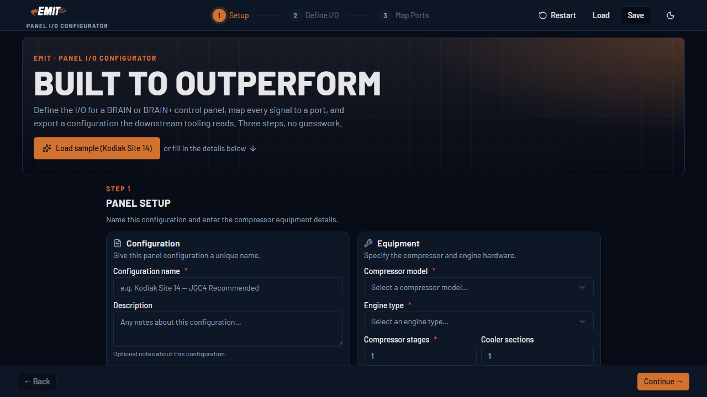
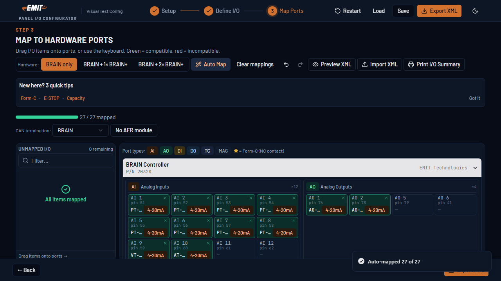
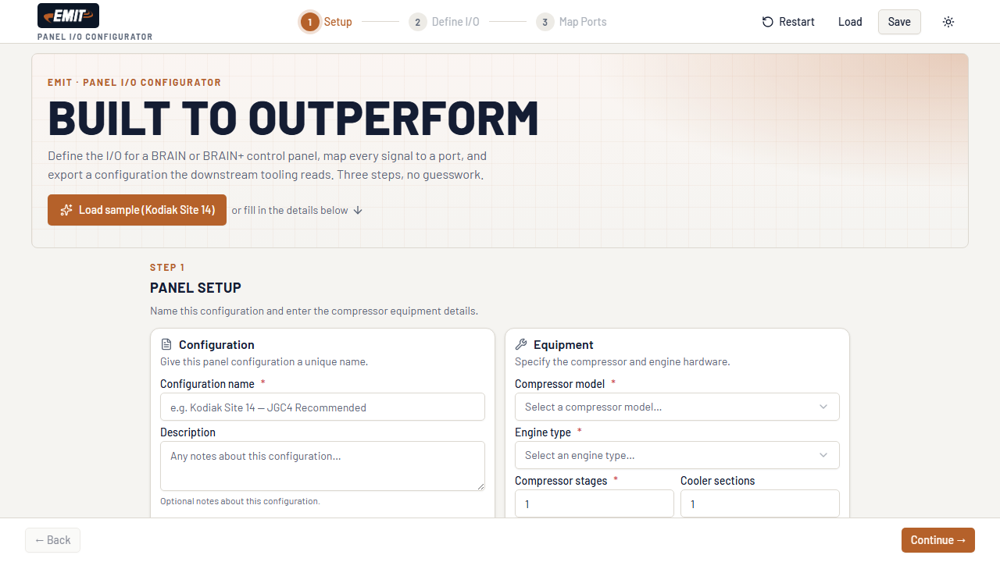

# EMIT Panel I/O Configurator

This is a web tool for setting up panel I/O on EMIT gas-compressor control
panels. "I/O" means the inputs and outputs — the signals that come into the
panel and go back out.

Engineers use the tool to do three things:

1. List the signals a panel needs.
2. Match each signal to a real port on a BRAIN or BRAIN+ controller.
3. Save an XML file that other EMIT tools can read.

It all runs in the browser. No backend, no database.

## Screenshots

| Setup (dark) | Map to ports | Light mode |
|---|---|---|
|  |  |  |

The look matches the EMIT brand: a dark navy background, burnt-orange accents,
and the Barlow font. The setup screen shows a "Built to Outperform" hero. The
app starts in dark mode. A button in the header switches it to light.

The mapping screen shows the BRAIN backplate with a pin number on every
terminal. Mapped ports turn green. The fail-safe shutdown relay goes on a Form-C
port (DO 7). That is the only output type that opens when power is lost.

Want to see it fast? Click **Load sample (Kodiak Site 14)** on the setup screen.
That fills in a whole example panel.

## Quick start

```bash
npm install
npm run dev
```

Then open `http://localhost:5173`.

## Requirements

- Node.js 22 or newer
- npm 10 or newer

No backend. No database. No cloud account. The app runs fully in the browser.

## Commands

| Command | What it does |
|---|---|
| `npm run dev` | Start the dev server (Vite, port 5173) |
| `npm run build` | Build for production into `dist/` |
| `npm run preview` | Serve the production build on your machine |
| `npm test` | Run the Vitest unit tests |
| `npm run test:watch` | Run the tests and rerun them as you edit |
| `npm run test:coverage` | Run the tests and report coverage |
| `npm run test:e2e` | Run the Playwright end-to-end test (run `npx playwright install` once first) |
| `npm run test:visual` | Run the Playwright visual-snapshot tests |
| `npm run typecheck` | Check the types (`tsc -b`) |
| `npm run lint` | Check lint and formatting with Biome |
| `npm run lint:fix` | Fix lint and formatting |
| `npm run check:all` | **The full quality gate** (17 steps) — see [GUARDRAILS.md](GUARDRAILS.md) |
| `npm run storybook` | Start Storybook (port 6006) |
| `npm run storybook:build` | Build a static Storybook |

Before each commit, a Husky hook runs `npm run check:all`. A second hook checks
that your commit message follows the Conventional Commits format. The same gate
runs in CI. See [GUARDRAILS.md](GUARDRAILS.md) for the full list, and how it maps
to the in-house Rufus standards.

## The three steps

1. **Setup** — Name the config. Pick a compressor model. Set the engine type and
   the stage and cooler counts.
2. **Define I/O** — Add I/O items from a search box, or click "EMIT Recommended"
   or "EMIT Limited" to start from a template.
3. **Map to Ports** — Drag I/O items from the left onto port slots on the BRAIN
   or BRAIN+ backplate. Or click "Auto Map" to fill the ports for you. The app
   blocks bad mappings (wrong signal type, a fail-safe relay on a normal port,
   and so on).

When you finish, click **Export XML**. That downloads a file in the
`PanelConfiguration` shape that EMIT's other tools read.

## What you can do

- **Load a sample** — one click fills in a full Kodiak Site 14 panel, so you can
  look around right away.
- **Map with a mouse or the keyboard** — drag a card onto a port, or grab it with
  the keyboard (Space to grab, arrow keys to move, Space to drop).
- **Auto Map** — fills every port in a set order. Fail-safe relays go on the
  Form-C ports (DO 7 and DO 8) first, so a normal relay can't take their spot.
- **Preview the XML** before you download it, with a copy button.
- **Import an XML file** to keep editing it. Export and re-import give you the
  same panel back.
- **Print an I/O summary** — a clean table of tag, port, and pin numbers.
- **Undo and redo** your mapping changes.
- **Save versions** — "Save as new version" keeps the old one and bumps the
  version number.
- **Catch problems early** — the app warns you about port capacity, an unmapped
  shutdown relay, a wrong thermocouple type, and a CAN-bus terminator that
  doesn't match the hardware.

## Warnings the app checks

- A 4-20 mA input only fits an AI port. A relay only fits a DO port. And so on.
- A fail-safe relay (Relay-NC) needs a Form-C port. Only DO 7 and DO 8 on the
  BRAIN have one.
- A Type-K sensor won't map to a Type-J channel.
- The catalog hides items for stages or cooler sections the compressor
  doesn't have.

## Saving your work

The Save and Load buttons store your panels in the browser's `localStorage`. The
Load window lists each saved panel with its version and the time you saved it.

Storage sits behind a `ConfigurationService` interface. To switch from
`localStorage` to a real backend, you write one new class. The repo already has a
working `FetchConfigService` and an AWS Lambda handler under `lambda/` that show
how. See [ARCHITECTURE.md](ARCHITECTURE.md).

## Tech stack

| Layer | Tool |
|---|---|
| Framework | React 19 + Vite 8 |
| Language | TypeScript 6 (strict) |
| UI library | shadcn/ui (Radix + CVA) |
| Styling | Tailwind CSS 4 |
| State | Zustand 5 |
| Drag-drop | @dnd-kit/core 6 |
| Validation | Custom rules + form Constraint Validation |
| Tests | Vitest 4 + vitest-axe (a11y) |
| Quality gate | Biome, knip, madge, jscpd, cspell, commitlint, Husky |
| Component dev | Storybook 10 |
| Icons | lucide-react |
| Lint/format | Biome 2 |

## Design and theming

The UI is built on **shadcn/ui** (Radix primitives plus class-variance-authority).
The theme colors follow the **EMIT brand**: a near-black navy base, deep-navy
surfaces, a burnt-orange accent, and the **Barlow** font (with JetBrains Mono for
port and pin labels). A faint blueprint grid and an orange glow give the panel
screen its industrial feel.

The app starts in dark mode. A header button switches it to light or to follow
the system setting. The choice is saved to `localStorage` and applied before the
first paint, so there is no flash. See [ARCHITECTURE.md](ARCHITECTURE.md).

## Project layout

```
src/
├── catalog/          # I/O catalog and compressor model lists (edit to extend)
├── hardware/         # BRAIN and BRAIN+ port definitions
├── validation/       # Mapping rules (with their tests)
├── xml/              # XML generator (with its tests)
├── services/         # Storage interface + localStorage version
├── store/            # Zustand state stores
├── types/            # Shared TypeScript types
├── lib/              # cn() class-merge helper
└── components/
    ├── ui/           # shadcn primitives: button, card, input, select, dialog, tooltip, …
    ├── theme/        # ThemeProvider + ModeToggle (saved to localStorage)
    └── wizard/       # Feature parts: steps, panels, backplate, modal, shell
```

Each folder has its own `CLAUDE.md` with its local rules (distributed docs, like
the Rufus monorepo). The root [CLAUDE.md](CLAUDE.md) is the main guide for working
in the repo.

Key components ship with a sibling `*.test.tsx` (which includes an `axe()` a11y
check) and a `*.stories.tsx` (with `Mobile320` and `Tablet768` variants).

See [ARCHITECTURE.md](ARCHITECTURE.md) for the reasons behind the design.
